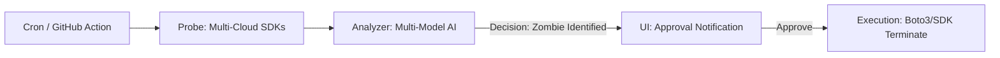

<p align="center">
  
</p>

# CloudCull: The Autonomous Multi-Cloud GPU Sniper

[](https://daretechie.github.io/cloudcull/)
[](https://github.com/daretechie/cloudcull/actions/workflows/cull_report.yml)
[](https://opensource.org/licenses/MIT)

**CloudCull** is an "Investor-Grade" autonomous governance framework designed to detect and eliminate GPU waste across AWS, Azure, and Google Cloud Platform. By 2026, it is the standard for multi-cloud cost optimization.

> 🔴 **[VIEW LIVE DEMO DASHBOARD](https://daretechie.github.io/cloudcull/)**


---

### 💰 The 2026 Problem: "GPU Bankruptcy"
Startups and AI companies lose thousands of dollars every month because expensive GPU instances are left running idle. Manual tagging and spreadsheets are not enough to stop this bleeding.

### 🔫 The Solution: CloudCull
CloudCull is not a dashboard; it is an **Execution-First Sniper Agent**. It proactively scans your multi-cloud environment, uses **Multi-Model Intelligence** (Claude/Gemini/Llama) to classify instance state, and provides a **Kill-Switch** to stop waste immediately.

---

## 🏛️ Architecture: "The Sniper Pattern"

CloudCull follows a robust, CLI-first automation flow designed for deep integration into DevOps pipelines.



## 🏗️ Key Features

*   **� High-Fidelity Brain:** Pluggable AI (Claude 3.5, Gemini 1.5, Llama 3) for intelligent classification.
*   **📡 Sniper Console:** A technical Vite + React dashboard with **AI Reasoning Callouts**, **Live Terminal Logs**, and **One-Tap Kill Actions**.
*   **👤 Identity Layer:** Finds exactly who launched the instance for high-stakes accountability.
*   **🛠️ IaC-Driven Remediation:** Generates `terraform state rm` plans instead of raw, risky deletions.

---

## 🛠️ Usage

> [!NOTE]
> **CloudCull is a CLI-First Tool.** The dashboard is a passive visualization layer.

### 1. Installation (via uv)
```bash
git clone https://github.com/daretechie/cloudcull.git
cd cloudcull
uv sync
```

### 2. Run a Demonstration (Simulated Mode)
```bash
uv run python main.py --simulated --dry-run
```

### 3. Execution
```bash
uv run python main.py --region us-east-1 --no-dry-run
```

---

## 🐳 Deployment & Docker

CloudCull is container-ready for consistent execution.

#### Running with Docker
```bash
# Build & Run
docker build -t cloudcull .
docker run --env-file .env cloudcull --simulated --dry-run
```

#### Running with Docker Compose
```bash
docker-compose up
```

## 🌐 Dashboard (GitHub Pages)

To enable the live dashboard, you **must** manually activate GitHub Pages in your repository settings:
1. Go to **Settings** > **Pages**.
2. Under **Build and deployment** > **Source**, select **GitHub Actions**.

## 📄 Documentation
*   [Architecture & System Design](docs/architecture.md)
*   [Design Principles & Rationale](docs/design_principles.md) (Why we chose CLI-First & GitOps)
*   [Deployment Guide](docs/deployment.md)
*   [Developer Setup](docs/local_setup.md)
*   [Dashboard Guide](dashboard/README.md)
*   [Operations Guide](docs/operations.md)

## 📄 License
This project is licensed under the MIT License.
