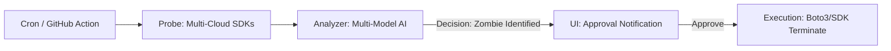

<p align="center">
  
</p>

# CloudCull: The Autonomous Multi-Cloud GPU Sniper

[](https://github.com/daretechie/cloudcull/actions/workflows/cull_report.yml)
[](https://opensource.org/licenses/MIT)

**CloudCull** is an "Investor-Grade" autonomous governance framework designed to detect and eliminate GPU waste across AWS, Azure, and Google Cloud Platform. By 2026, it is the standard for multi-cloud cost optimization.


---

### 💰 The 2026 Problem: "GPU Bankruptcy"
Startups and AI companies lose thousands of dollars every month because expensive GPU instances (e.g., AWS P5, GCP A3, Azure NDv5) are left running idle. Manual tagging and spreadsheets are not enough to stop this bleeding.

### 🔫 The Solution: CloudCull
CloudCull is not a dashboard; it is an **Execution-First Sniper Agent**. It proactively scans your multi-cloud environment, uses **Multi-Model Intelligence** (Claude/Gemini/Llama) to classify instance state, and provides a **Kill-Switch** to stop waste immediately.

---

## 🏛️ Architecture: "The Sniper Pattern"

CloudCull follows a robust, CLI-first automation flow designed for deep integration into DevOps pipelines.



## 🏗️ Key Features

*   **🧟 Multi-Cloud Sniper:** Native support for AWS EC2, Azure VMs, and GCP Compute Engine.
*   **👤 Identity Layer (CloudTrail/Audit):** Finds exactly who launched the instance for high-stakes accountability.
*   **🛠️ IaC-Driven Remediation:** Generates `terraform state rm` plans instead of raw, risky deletions.
*   **🧠 Brain (LLMAdapter):** Pluggable 2026 AI (Claude 3.5+, Gemini 1.5, Llama 3) for intelligent classification.
*   **📊 Low-Latency Dashboard:** A high-fidelity Vite + React dashboard hosted at $0 cost on GitHub Pages.

---

## 🛠️ Usage

> [!NOTE]
> **CloudCull is a CLI-First Tool.** The dashboard is a passive visualization layer. To audit or terminate resources, you must use the terminal commands below.

### 1. Installation
```bash
git clone https://github.com/daretechie/cloudcull.git
cd cloudcull
uv init
uv add boto3
```

### 2. Run a Demonstration (Simulated Mode)
Run a full multi-cloud audit without needing cloud credentials or AI API keys. Perfect for testing and demonstrations:
```bash
uv run python main.py --simulated --dry-run
```

### 3. Run a Real Audit (Dry Run)
```bash
uv run python main.py --region us-east-1 --dry-run
```

### 4. Execution (The Kill-Switch)
```bash
uv run python main.py --region us-east-1 --no-dry-run
```

### Example Output
```text
===============================================================================================
| PLATFORM   | INSTANCE ID          | OWNER           | SAVINGS/MO   | DECISION |
===============================================================================================
| Azure      | vm-prod-gpu-01       | @azure_admin    | $648.00      | 🧟 ZOMBIE      |
| GCP        | gcp-ml-node-99       | @gcp_dev        | $2,642.40    | 🧟 ZOMBIE      |
===============================================================================================
💰 POTENTIAL MONTHLY SAVINGS: $3,290.40
✅ Found idle Standard_NC6s_v3. Launched by: @azure_admin. Potential Savings: $648.00/mo.
✅ Found idle a2-highgpu-1g. Launched by: @gcp_dev. Potential Savings: $2,642.40/mo.
===============================================================================================

--- SUGGESTED IAC ACTIONS ---
Resource: vm-prod-gpu-01 | Action: terraform state rm aws_instance.vm-prod-gpu-01 | Owner: azure_admin
Resource: gcp-ml-node-99 | Action: terraform state rm aws_instance.gcp-ml-node-99 | Owner: gcp_dev
------------------------------
```

---

## � Deployment & CI/CD

### GitHub Actions
CloudCull uses GitHub Actions for autonomous hourly audits. Ensure the following secrets are configured in your repository:
- `AWS_ACCESS_KEY_ID`, `AWS_SECRET_ACCESS_KEY`
- `ANTHROPIC_API_KEY`, `OPENAI_API_KEY`, etc.

### 🌐 Dashboard (GitHub Pages)
> [!IMPORTANT]
> To enable the live dashboard, you **must** manually activate GitHub Pages in your repository settings:
> 1. Go to **Settings** > **Pages**.
> 2. Under **Build and deployment** > **Source**, select **GitHub Actions**.
> 3. The next workflow run will automatically deploy the dashboard to your GitHub Pages URL.

## �📄 Documentation
*   [Strategic Blueprint](docs/blueprint.md)
*   [Architecture Rationale](docs/architecture_rationale.md)

## 📄 License
This project is licensed under the MIT License - see the `LICENSE` file for details.
